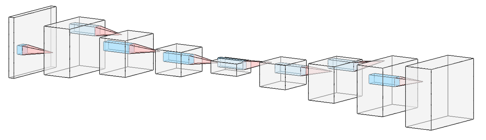

## About us
We are are a new research group headed at the [Helmholtz Centre Geesthacht](https://www.hzg.de/index.php.en) near Hamburg, within the [Institute of Coastal Research](https://www.hzg.de/institutes_platforms/coastal_research/index.php.en). Our group, led by David Greenberg, is part of the [Helmholtz AI](https://www.helmholtz.ai/) initiative.

## Our research
Our ultimate aim is to understand and predict the complex dynamics of Earth’s atmosphere, ocean, land and ice.

### Physical Models vs. Data Models 
Numerical simulations based on known physics simulators handle complex systems well, but struggle with data assimilation, parameter tuning and uncertainty quantification.

 Simulation from the [Lorenz 96](http://eaps4.mit.edu/research/Lorenz/Predicability_a_Problem_2006.pdf) model. Defined as a system of differential equations, it exhibits many of the challenges appearing in more realistic models of climate and weather phenomena, such as chaotic dynamics and coupling of fast and slow processes.

Conversely, machine learning techniques can absorb and process large datasets, but typically ignore physics and generalize poorly to new scenarios.

 Example of a Unet architecture used for weather prediction.

  
  

We develop hybrid methods that combine deep learning with physical models in a Bayesian framework. We investigate the Earth system at the boundary between physics- and data-driven approaches, to gain insights unavailable to either approach alone.

Examples of this hybrid approach include:
* Neural networks that solve differential equations.
* Algorithms trained to infer model parameters using simulations.
* Machine learning models that respect physical laws.
* Flexible function approximators to fill gaps in our physical knowledge.
* Normalizing Flows, VAEs and GANs that model uncertainty in temperature, rainfall, fire and flooding.

## Machine Learning Seminar
We organize a weekly seminar on machine learning. We discuss papers on ML, often (but not always) with a connection to Earth science, climate and weather.

The seminar also allows members of the Hamburg machine learning community to connect and present their ongoing work. We meet in person at HZG, but we also welcome remote online participants and stream the meeting live on our [YouTube channel](https://www.youtube.com/channel/UCyXAYFO3h-tBIEbPEqMnNKw). To get updates about each meeting, please [join our mailing list](https://groups.google.com/forum/#!forum/mlhzg/join). 

## Online code
We publish our code on [github](https://github.com/m-dml), and are committed to software sharing as a principle of open and reproducible science.

## Open positions
If you're interested in a position as a Master's student, PhD or Postdoc, please write to [David](mailto:david.greenberg@hzg.de) with a CV and statement of interest. 
