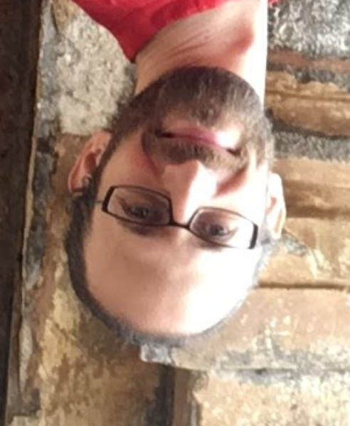

## Group members
 <table border="0" style="width:100%; border-spacing: 10px">
  <colgroup>
    <col style="width:30%">
    <col>
  </colgroup>
  <tr>
    <td style="vertical-align:middle">
      
    </td>
    <td style="vertical-align:top">
      <strong>David Greenberg</strong>
       
      Group Leader
        
      David leads the M-DML group. Before moving to Earth science, he did a Postdoc in Machine Learning and a PhD in computational Neuroscience.
      His primary research goal is applying machine learning to address critical computational problems in Earth science, such as predictability, parameter tuning, parameterization, uncertainty quantification and data assimilation. 
    </td>
  </tr>
  <tr>
    <td style="vertical-align:middle">
      
    </td>
    <td style="vertical-align:top">
      <strong>Marcel Nonnenmacher</strong> 
      Postdoc  
      Marcel joined the lab in February 2020 and works on data-driven weather prediction. He's interested in representing prediction uncertainty through probability distributions. During his PhD in computational neuroscience, he worked on probabilistic modeling for incomplete data and black-box Bayesian inference.
    </td>
  </tr>
</table> 