## Group members
 <table border="0" style="width:100%; border-spacing: 10px">
  <colgroup>
    <col style="width:20%">
    <col>
  </colgroup>
  <tr>
    <td style="vertical-align:middle">
      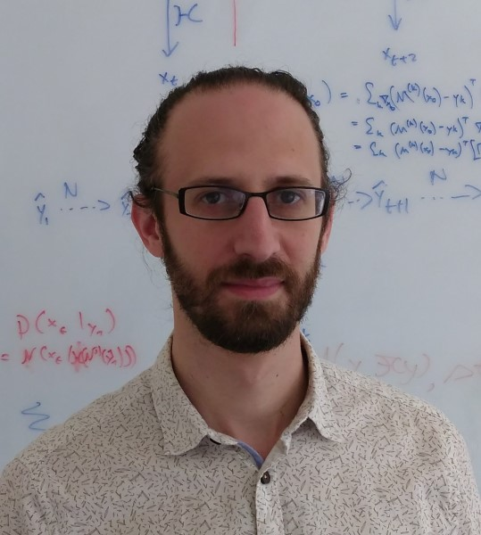
    </td>
    <td style="vertical-align:top; text-align:justify">
      <strong>David Greenberg</strong>
       
      Group Leader
        
      David leads the M-DML group. Before moving to Earth science, he did a Postdoc in ML and a PhD in computational neuroscience.
      His primary research goal is applying machine learning to address critical computational problems in Earth science, such as predictability, parameter tuning, parameterization, uncertainty quantification and data assimilation. 
    </td>
  </tr>

  <tr>
    <td style="vertical-align:middle">
      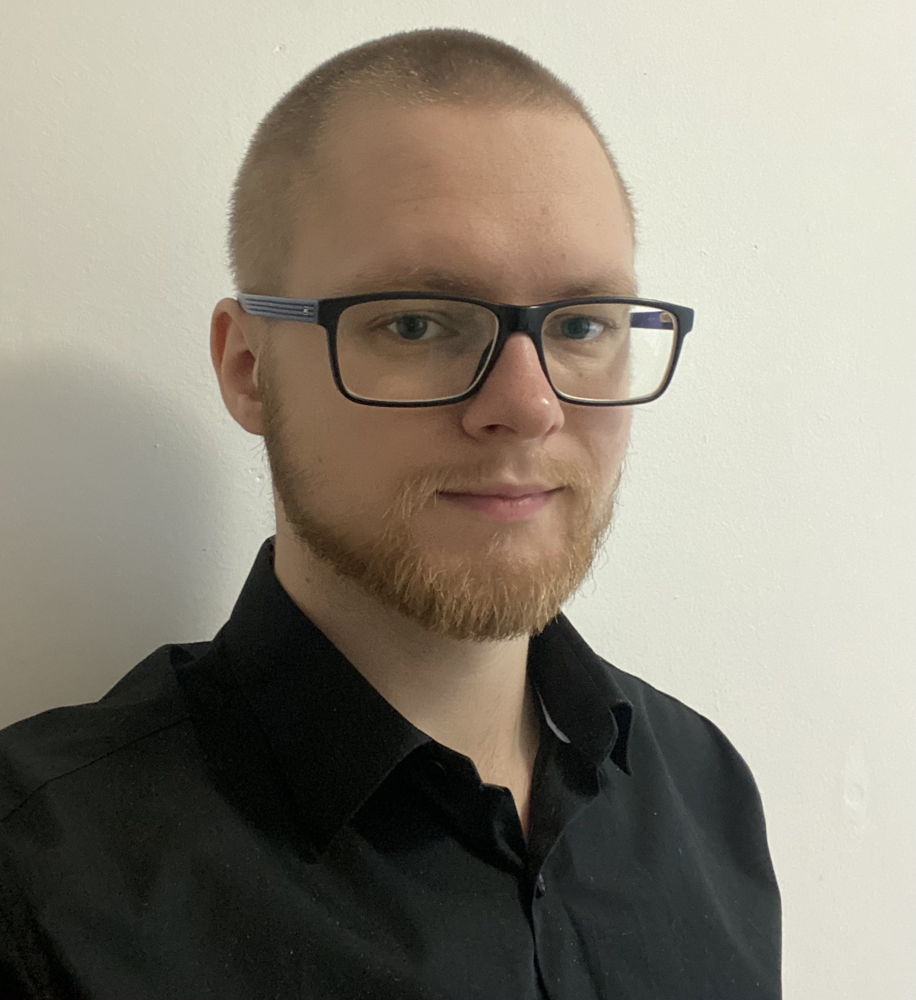
    </td>
    <td style="vertical-align:top; text-align:justify">
      <strong>Vadim Zinchenko</strong> 
      PhD Student  
      Vadim's research focuses on the intersection of machine learning and Earth system modelling. He develops algorithms to combine of data-driven and numerical modelling. He's particulary interested in developing machine learning frameworks that can be applied for inverse problems in the geosciences, such as data assimilation, parameter tuning and process learning from noisy and incomplete observations. He is a participant in the <a href="https://www.coastalfutures.de/index.php.en">CoastalFutures</a> project of the <a href="https://www.allianz-meeresforschung.de/en/">German Alliance for Marine Research</a>.
    </td>
  </tr>
 
  <tr>
    <td style="vertical-align:middle">
      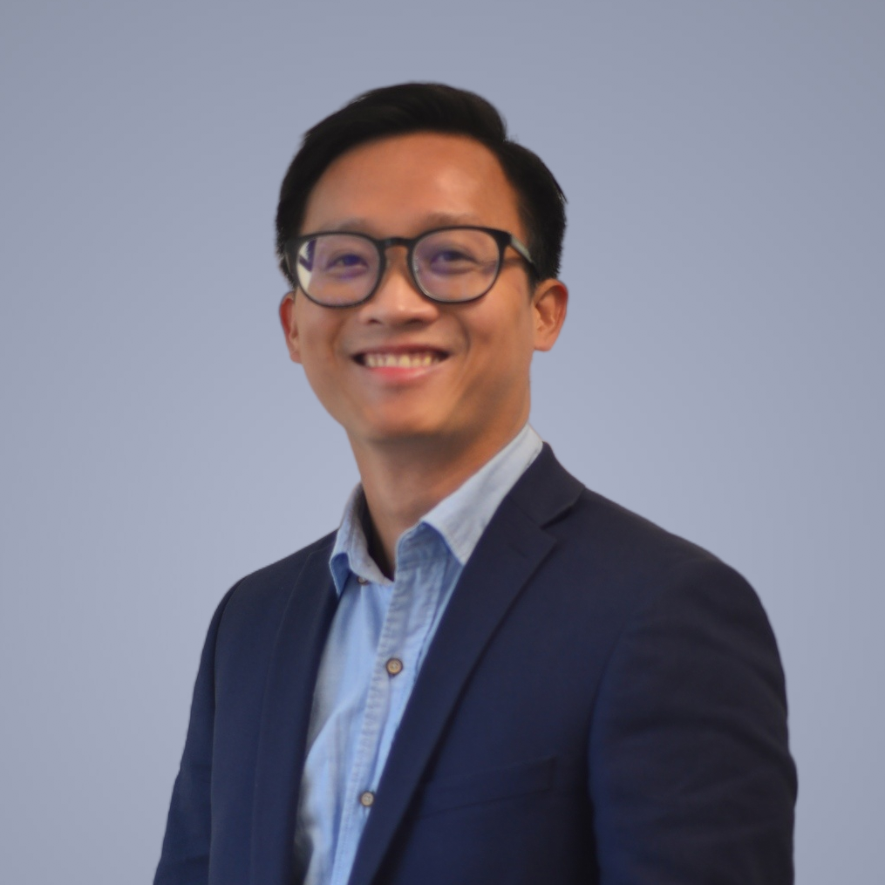
    </td>
    <td style="vertical-align:top; text-align:justify">
      <strong>Minh Nguyen</strong> 
      Postdoc  
      Minh's research focuses on differentiable physics approaches for ocean modelling. Using a combination of numerical methods and data-driven ML, he develops techniques for gradient-based optimization in realistic ocean models, and in particular for <a href="https://www.nemo-ocean.eu">NEMO</a>. Applications include data assimiliation, parameter tuning and parametrization learning. He is funded by <a href="https://www.edito-modellab.eu">EDITO ModelLab</a>, an EU project aiming to create digital twins of the ocean.
    </td>
  </tr>

<tr>
    <td style="vertical-align:middle">
      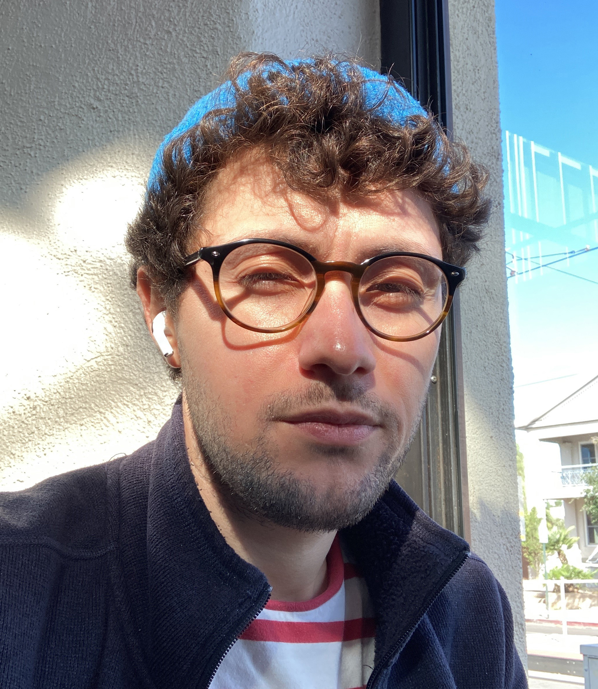
    </td>
    <td style="vertical-align:top; text-align:justify">
      <strong>Ali Can Bekar</strong> 
      Postdoc   
      Ali's work revolves around using machine learning to enhance numerical simulations. He's particularly interested in applied mathematics, fluid mechanics, and scientific computing. Lately, he's been delving into the simulations of mantle convection in Mars and Mercury.
    </td>
  </tr>

  <tr>
    <td style="vertical-align:middle">
      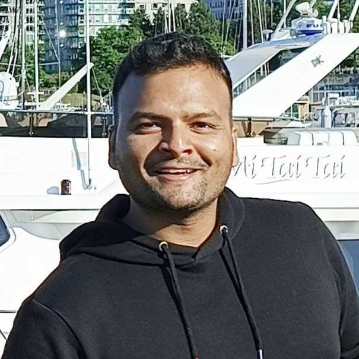
    </td>
    <td style="vertical-align:top; text-align:justify">
      <strong>Nishant Kumar</strong> 
      Postdoc   
      Nishant’s research focuses on advancing generative AI methodologies to address complex challenges in computer vision. His work also involves applying invertible neural networks to solve inverse problems. Currently, he is interested in leveraging his machine learning expertise to improve climate and earth system modeling. His full profile is available on his <a href="https://nish03.github.io/">personal homepage</a>. He is supported by the <a href="https://hclimrep-project.de/">HClimRep project</a>, a Helmholtz Foundation Model Initiative for developing cutting-edge AI foundation models for climate research.
    </td>
  </tr>

  <tr>
    <td style="vertical-align:middle">
      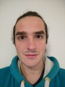
    </td>
    <td style="vertical-align:top; text-align:justify">
      <strong>Anthony Frion</strong> 
      Postdoc   
      Anthony develops ML-based methods for data assimilation in geoscientific simulations, with an emphasis on uncertainty quantification with generative models. He is also leading efforts develop benchmarks for data assimilation and other inverse problems, to quantify the performance of classical and ML-based algorithms.
    </td>
  </tr>

  <tr>
    <td style="vertical-align:middle">
      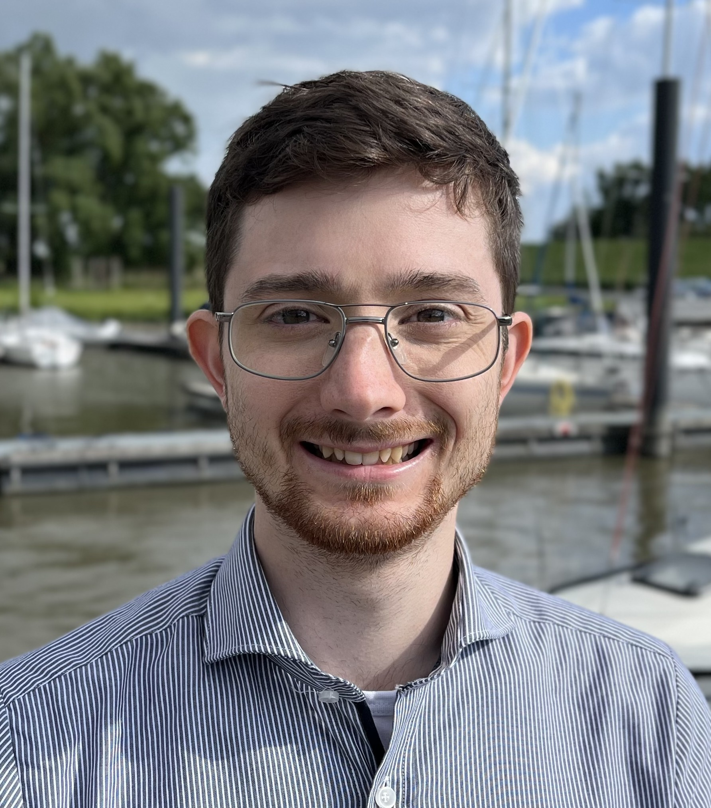
    </td>
    <td style="vertical-align:top; text-align:justify">
      <strong>Pauleo Nimtz</strong> 
      Masters Student   
      Pauleo's work focuses on differentiable solvers and transport operators, with application to biogeochemical modeling. He is developing and applying these methods to tune ecosystem models based on field observations of species and nutrient abundances. A critical aspect of this work concerns the interaction of coupled physical and biogeochemical processes.
    </td>
  </tr>

</table> 

## Alumni
 <table border="0" style="width:100%; border-spacing: 10px">
  <colgroup>
    <col style="width:20%">
    <col>
  </colgroup>

  <tr>
    <td style="vertical-align:middle">
      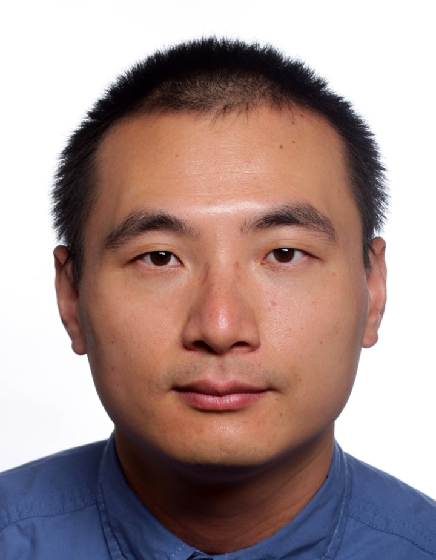
    </td>
    <td style="vertical-align:top; text-align:justify">
      <strong>Yunfei Huang</strong> 
      Postdoc  
      Yunfei (<a href="https://yunfei-huang0.github.io/">personal website</a>)worked on data-driven modeling for the Earth system. His research focused on the use of physical and symmetry constraints in emulation of geophysical fluid dynamics. Previously, he obtained PhD in biophysics at the university of Cologne on advanced data analysis for traction force microscopy and data-driven discovery of physical equations. He is now a postdoc at <a href="https://www.tu-dortmund.de/">TU Dortmund</a>.
    </td>
  </tr>

  <tr>
    <td style="vertical-align:middle">
      
    </td>
    <td style="vertical-align:top; text-align:justify">
      <strong>Andrey Vlasenko</strong> 
      Postdoc   
      Andrey developed ML methods to effectively replace computationally intensive atmospheric chemistry calculations in complex climate systems. His position was funded by the Helmholtz AI project NACHMO.
    </td>
  </tr>

  <tr>
    <td style="vertical-align:middle">
      
    </td>
    <td style="vertical-align:top; text-align:justify">
      <strong>Marcel Nonnenmacher</strong> 
      Postdoc   
      Marcel worked on data-driven weather prediction. He's interested in representing prediction uncertainty through 
probability distributions. During his PhD in computational neuroscience, he worked on probabilistic modeling for 
incomplete data and black-box Bayesian inference. He is now a postdoc at UCL's <a href = "https://www.ucl.ac.uk/gatsby/gatsby-computational-neuroscience-unit">Gatsby unit</a> in London.
    </td>
  </tr> 

 <tr>
    <td style="vertical-align:middle">
      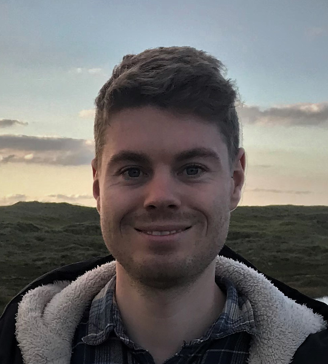
    </td>
    <td style="vertical-align:top; text-align:justify">
      <strong>Tobias Schanz</strong> 
      PhD Student  
      Tobias started his PhD in the m-dml group in August 2020, after finishing his Masters in Meteorology at the University of Hamburg. 
      He worked on conditional density estimation with an emphasis on ensemble methods, and self-supervised learning for aquatic life imaging. After finishin his PhD in 2024, he now works as an AI engineer at <a href="https://iits-consulting.de">iits-consulting</a>.
    </td>
  </tr>

<tr>
    <td style="vertical-align:middle">
      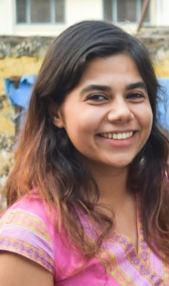
    </td>
    <td style="vertical-align:top; text-align:justify">
      <strong>Shivani Sharma</strong> 
      PhD Student   
      Shivani started her PhD in October 2020, after completing her Master's in Atmospheric Science at IIT Delhi. Her research applied machine learning to cloud microphysics parametrizations in atmospheric models, and coupling of ML models to Fortran-based simulations. She completed her PhD in 2024.
    </td>
  </tr>

  <tr>
    <td style="vertical-align:middle">
      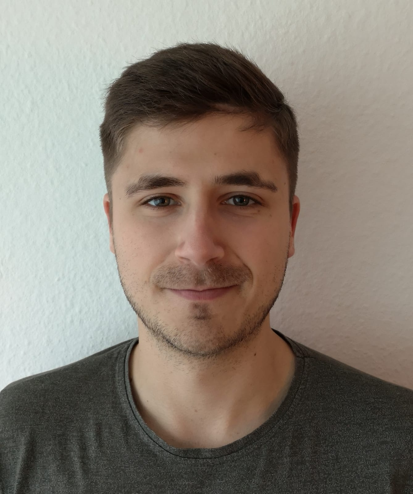
    </td>
    <td style="vertical-align:top; text-align:justify">
      <strong>Kubilay Demir</strong> 
      Masters Student   
      Kubilay was enrolled in the masters program in Ocean and Climate Physics at the University of Hamburg. His research, carried out jointly with <a href = "https://hereon.de/institutes/coastal_systems_analysis_modeling/matter_transport_ecosystem_dynamics/team/098744/index.php.en">Kai Logemann</a> at Hereon, applied the principle of Physics Informed Neural Networks to oceanographic problems. He is now a PhD student at Hereon's Institute of Coastal research, working on nutrient cycles in ocean ecosystem models.
    </td>
  </tr>

  <tr>
    <td style="vertical-align:middle">
      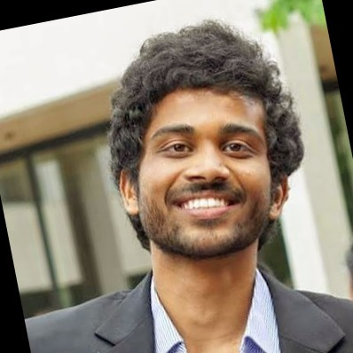
    </td>
    <td style="vertical-align:top; text-align:justify">
      <strong>Naveen Parameswaran</strong> 
      PhD exchange student  
      Naveen's research revolves around prediction tasks in the marine geosciences. He focuses on using machine learning methods to obtain a global prediction map of sedimentation rates in the seafloor. As a PhD student at GEOMAR in Kiel, he visited our group on a fellowship funded by the <a href="https://www.helmholtz-hida.de/en/new-horizons/trainee-network/">HIDA trainee network</a>.
    </td>
  </tr>

 
</table> 

