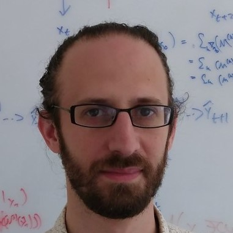

## Group members
 <table border="0" style="width:100%; border-spacing: 10px">
  <colgroup>
    <col style="width:30%">
    <col>
  </colgroup>
  <tr>
    <td style="vertical-align:middle">
      
    </td>
    <td style="vertical-align:top; text-align:justify">
      <strong>David Greenberg</strong>
       
      Group Leader
        
      David leads the M-DML group. Before moving to Earth science, he did a Postdoc in ML and a PhD in computational neuroscience.
      His primary research goal is applying machine learning to address critical computational problems in Earth science, such as predictability, parameter tuning, parameterization, uncertainty quantification and data assimilation. 
    </td>
  </tr>

  <tr>
    <td style="vertical-align:middle">
      
    </td>
    <td style="vertical-align:top; text-align:justify">
      <strong>Tobias Machnitzki</strong> 
      PhD Student   
      Tobias started his PhD in the m-dml group in August 2020, after finishing his Masters in Meteorology at the University of Hamburg. 
      He works on conditional generative adversarial networks with the intention to use their output diversity for estimating uncertainties 
      in weather prediction tasks.
    </td>
  </tr>  

  <tr>
    <td style="vertical-align:middle">
      
    </td>
    <td style="vertical-align:top; text-align:justify">
      <strong>Shivani Sharma</strong> 
      PhD Student   
      Shivani completed her master's in Atmospheric Science from Indian Institute of Technology, Delhi. She's interested in using machine learning for parametrizations in atmospheric models to improve the representation of sub-grid scale processes and generate more accurate forecasts.
    </td>
  </tr>
  
  <tr>
    <td style="vertical-align:middle">
      
    </td>
    <td style="vertical-align:top; text-align:justify">
      <strong>Vadim Zinchenko</strong> 
      Masters Student   
      Vadim is a student of an international joint master program for Polar and Marine science between St. Petersburg State University (Russia) and Hamburg University. He works on a parameter tuning for Earth System Models using neural networks as conditional emulators and high order integration schemes.
    </td>
  </tr>

  <tr>
    <td style="vertical-align:middle">
      
    </td>
    <td style="vertical-align:top; text-align:justify">
      <strong>Yunfei Huang</strong> 
      Postdoc   
      Yunfei works on data-driven modeling for the Earth system. He is interested in the uncertainty quantification using deep learning, Bayesian approaches, and information theory. Previously, he obtained PhD in biophysics at the university of Cologne on advanced data analysis for traction force microscopy and data-driven discovery of physical equations.
    </td>
  </tr>

</table> 

## Alumni
 <table border="0" style="width:100%; border-spacing: 10px">
  <colgroup>
    <col style="width:30%">
    <col>
  </colgroup>

  <tr>
    <td style="vertical-align:middle">
      
    </td>
    <td style="vertical-align:top; text-align:justify">
      <strong>Marcel Nonnenmacher</strong> 
      Postdoc   
      Marcel worked on data-driven weather prediction. He's interested in representing prediction uncertainty through 
probability distributions. During his PhD in computational neuroscience, he worked on probabilistic modeling for 
incomplete data and black-box Bayesian inference. He is now a postdoc at UCL's <a href = "https://www.ucl.ac.uk/gatsby/gatsby-computational-neuroscience-unit">Gatsby unit</a> in London.
    </td>
  </tr> 

  <tr>
    <td style="vertical-align:middle">
      
    </td>
    <td style="vertical-align:top; text-align:justify">
      <strong>Kubilay Demir</strong> 
      Masters Student   
      Kubilay was enrolled in the MSc. program in Ocean and Climate Physics at the University of Hamburg. His research, carried out jointly with <a href = "https://hereon.de/institutes/coastal_systems_analysis_modeling/matter_transport_ecosystem_dynamics/team/098744/index.php.en">Kai Logemann</a> at Hereon, applied the principle of Physics Informed Neural Networks to oceanographic problems. He is now a PhD student at Hereon's Institute of Coastal research.
    </td>
  </tr>
  
</table> 