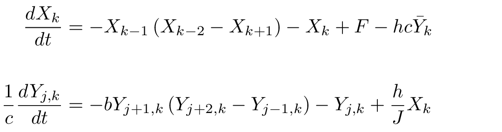
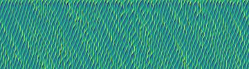
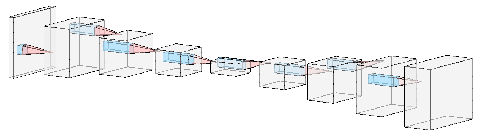
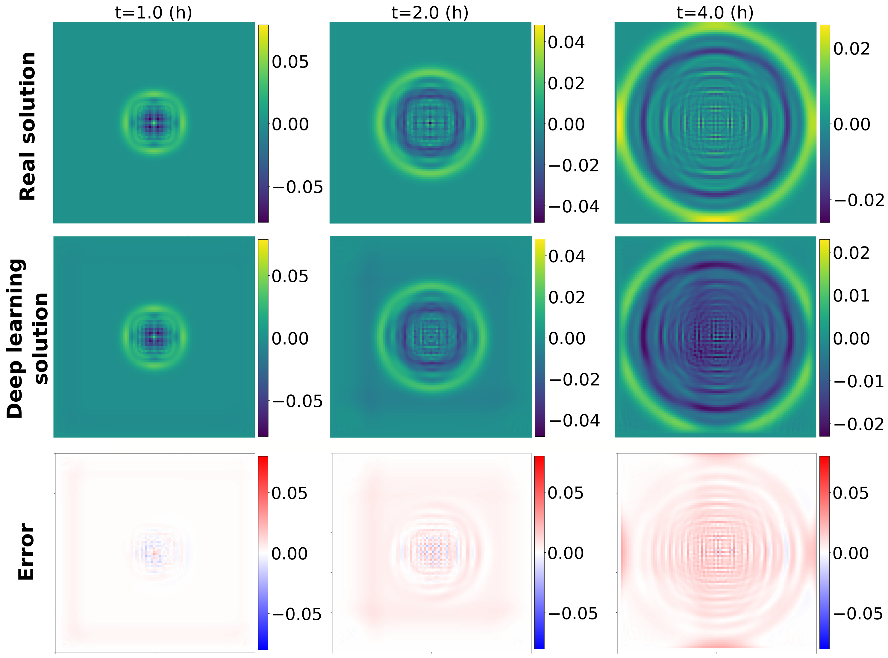
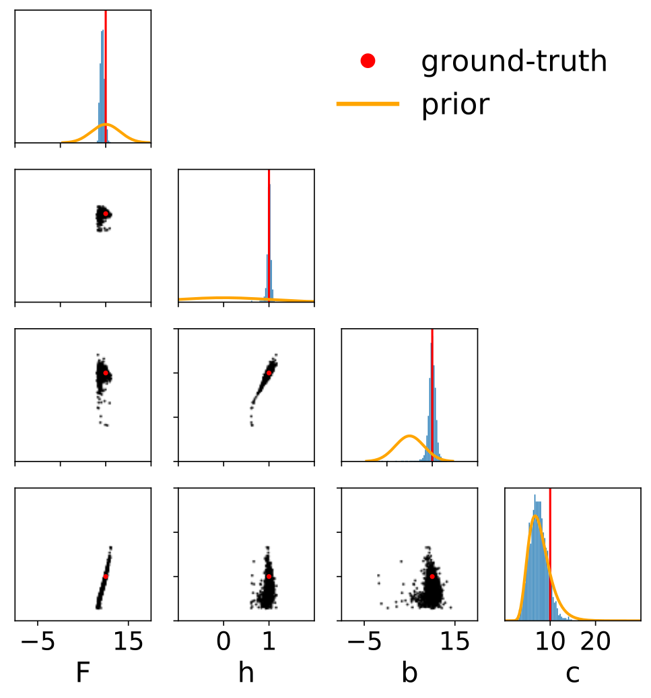

## Research
We develop hybrid geoscientific models combining machine learning (ML) with numerical simulation. ML approaches thrive on big data, but ignore physical laws and generalizes poorly to new scenarios outside their training data. Numerical simulations incorporate scientific knowledge and generalize well, but struggle with data-oriented tasks such as parameter tuning and data assimilation.

We use hybrid models to better, forecast, simulate and understand the atmosphere and ocean. Current application domains include are particularly interested in cloud microphysics, precipitation nowcasting, atmospheric chemistry and biological processes in coastal ocean regions.

### Physics-based Numerical Simulation
Numerical simulations in the geosciences describe fluid dynamics, advection, radiation, turbulence and other physical, chemical and biological processes. Simulations typically involve time integration of partial differential equations (PDEs) that have been discretized in space and time.

By building simulation programs from modular components describing each process, it is possible to describe and predict complex natural phenomena such as cloud formation, ocean circulation and long term changes in the planet's climate. Because numerical simulations in the geosciences are based on solid physical understanding, they tend to generalize well to new scenarios. However, their structure and technical implementation can prove a major hindrance when trying to solve important inverse problems. Examples of these include the data assimilation, parameter tuning and uncertainty quantification arise in the context of weather prediction.

 

Simulation for the [Lorenz 96](http://eaps4.mit.edu/research/Lorenz/Predicability_a_Problem_2006.pdf) model. Defined as a system of differential equations, it exhibits many of the challenges appearing in more realistic models of climate and weather phenomena, such as chaotic dynamics and coupling of fast and slow processes.  

  

### Machine Learning
Conversely, ML excels at precisely the sort of inverse problems that are challenging for physics-based numerical simulations. ML models can absorb and process large datasets, and are built from the ground up for gradient-based optimization on modern hardware. However, data-centric ML ignores scientific knowledge and generalizes poorly to new scenarios outside its training data.

    Example of a Unet architecture used for weather prediction, visualized using [NN-SVG](https://doi.org/10.21105/joss.00747).

  

### Model-driven Machine Learning

We develop hybrid methods that combine the advantages of deep learning and physical modeling. Examples of this hybrid approach include:
* Neural networks that solve differential equations.
* Neural networks that [learn to differentiate](https://agupubs.onlinelibrary.wiley.com/doi/full/10.1029/2021MS002554) the outputs of a numerical simulation with respect to its inputs.
* Algorithms that learn to infer model parameters from observation data, using simulation results as training data.
* Machine learning models that respect physical laws such as conservation of mass or rotational symmetry.

 The [shallow water equations](https://en.wikipedia.org/wiki/Shallow_water_equations) are a system of 2D PDEs that are often used to test numerical simulations of fluid flow in the ocean or atmosphere. Here a numerical simulation from a semiimplicit integration scheme (upper row) is compared to unsupervised deep learning combining a physics-based loss with group-equivariant convolutions. While the numerical simulation approach must iteratively solve a system of linear equations at each time step, the ML model learns to carry out the same time integration using a non-iterative feed-forward scheme.

* Generative models such as normalizing Flows, VAEs and GANs that model uncertainty in temperature, rainfall, fire and flooding in a Bayesian framework. 
  

 Parameter inference for the Lorenz 96 model using the [APT-SNPE algorithm](https://arxiv.org/abs/1905.07488).
 Here the task is to identify the values of four model parameters (F, h, b, c) based on the outputs of the L96 model. 
 Prior beliefs regarding possible parameter values are updated after observing data into narrower posterior ranges of plausible parameter values given data, which are centered on the ground-truth parameters. Each black dot is a single sample from the probability distribution p(parameters | data). 

 

* Flexible function approximators to fill gaps in our knowledge of physics, chemistry or biology.
* Models trained on high-resolution numerical simulations to represent the spatially averaged effect of sub-grid-scale processes on coarser, more computationally efficient model grids.
* Neural networks that learn carry out data assimilation, identifying the initial state of a system from noisy and incomplete observations at later time points 
* New neural network layers [based on classical techniques of numerical simulation](https://openreview.net/pdf?id=veNBQ15T6N0)

Often, hybrid models representing simulated processes are ultimately packaged as efficient, accurate and easy-to-use `building blocks’ for building climate and weather simulations.