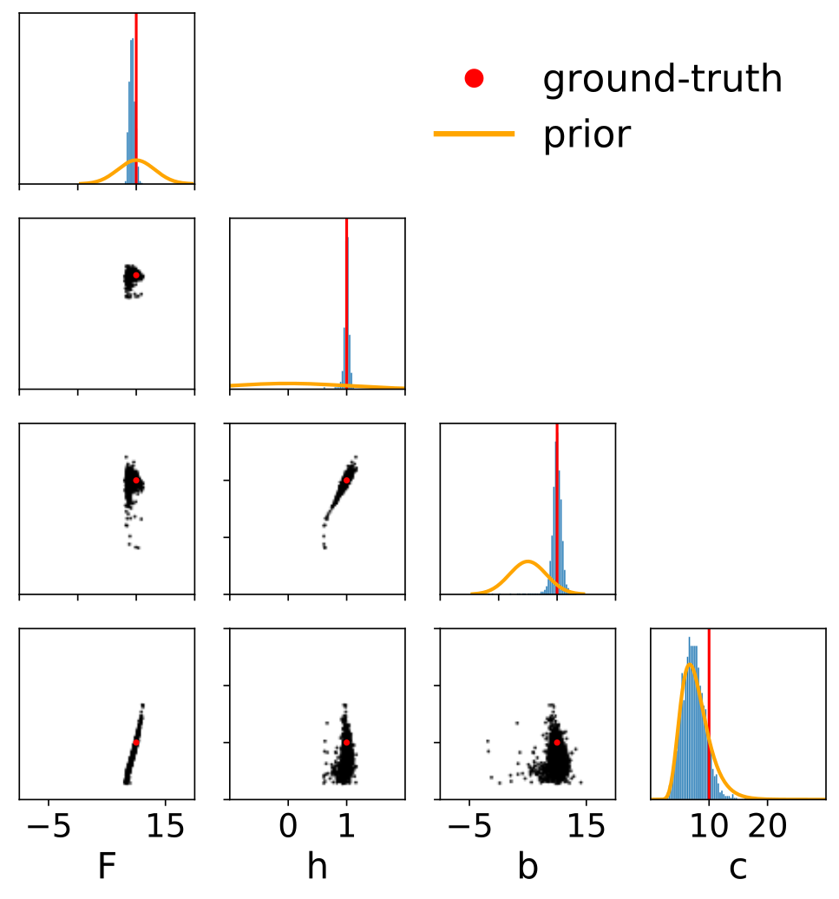

## Research
Our ultimate aim is to understand and predict the complex dynamics of the Earth’s atmosphere, ocean, land and ice.

### Physical Models
Numerical simulations based on known physics simulators handle complex systems well, but struggle with data assimilation, parameter tuning and uncertainty quantification.

  
   
 Simulation for the [Lorenz 96](http://eaps4.mit.edu/research/Lorenz/Predicability_a_Problem_2006.pdf). Defined as a system of differential equations, it exhibits many of the challenges appearing in more realistic models of climate and weather phenomena, such as chaotic dynamics and coupling of fast and slow processes..  
   

  

### Machine Learning
Conversely, machine learning techniques can absorb and process large datasets, but typically ignore physics and generalize poorly to new scenarios.

 Example of a Unet architecture used for weather prediction, visualized using [NN-SVG](https://doi.org/10.21105/joss.00747).

  

### Model-driven Machine Learning
We develop hybrid methods that combine the advantages of deep learning and physical modeling in a Bayesian framework. Examples of this hybrid approach include:
* Neural networks that solve differential equations.
* Algorithms that learn to infer model parameters using simulation results as training data.
* Machine learning models that respect physical laws.
* Flexible function approximators to fill gaps in our physical knowledge.
* Normalizing Flows, VAEs and GANs that model uncertainty in temperature, rainfall, fire and flooding.

 Parameter inference for the [Lorenz 96](http://eaps4.mit.edu/research/Lorenz/Predicability_a_Problem_2006.pdf) model. Prior believes over possible parameter values are updated after observing data into narrower posterior believes centered on the ground-truth parameters.  

  
